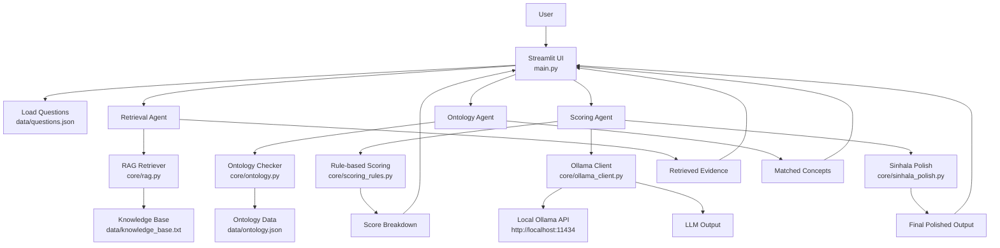
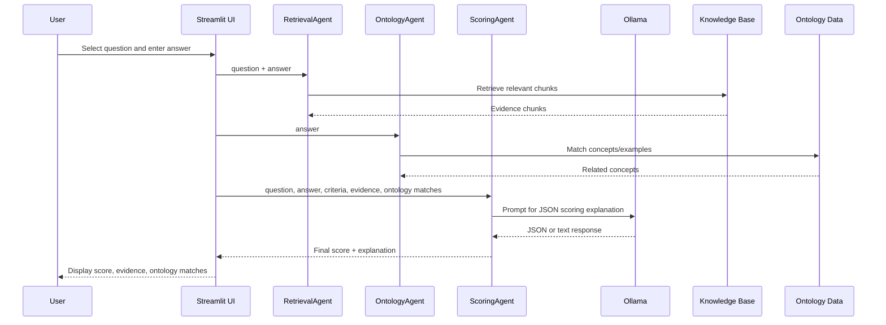

# Sinhala History Answer Scorer

An offline, AI-assisted Sinhala open-ended answer scoring system for Sri Lankan history questions, built with `Streamlit`, rule-based scoring, lightweight retrieval, ontology matching, and a local `Ollama` model.

This project is focused on evaluating student answers for questions related to the **Anuradhapura Period** in Sri Lankan history.

---

## Features

- **Offline scoring workflow**
  - Uses a local `Ollama` model for explanation generation
  - No external cloud API required for the main scoring flow

- **Sinhala answer evaluation**
  - Accepts student answers in Sinhala
  - Supports Sinhala text processing and output polishing

- **Rule-based marking**
  - Each question has predefined criteria and keywords
  - Scores are calculated from keyword overlap

- **Retrieval-Augmented Generation (RAG)**
  - Retrieves relevant evidence from a local knowledge base
  - Helps the model stay grounded in the expected topic

- **Ontology-based concept matching**
  - Detects important historical concepts in student responses
  - Improves contextual awareness

- **Streamlit UI**
  - Simple web interface for selecting questions, entering answers, and viewing scores

---

## Project Overview

The app scores answers using a hybrid pipeline:

1. The user selects a history question from `data/questions.json`
2. The user enters a Sinhala answer
3. The system:
   - retrieves supporting evidence from `data/knowledge_base.txt`
   - matches ontology concepts from `data/ontology.json`
   - calculates a rule-based score from the criteria keywords
   - sends a prompt to local `Ollama` for explanation generation
4. The final score and explanation are displayed in the UI

---

## Architecture

### High-level architecture diagram



### Scoring workflow



---

## Repository Structure

```text
sinhala-history-scorer/
├── main.py
├── pyproject.toml
├── README.md
├── requirement.txt
├── uv.lock
├── core/
│   ├── agents.py
│   ├── ollama_client.py
│   ├── ontology.py
│   ├── rag.py
│   ├── scoring_rules.py
│   └── sinhala_polish.py
├── data/
│   ├── knowledge_base.txt
│   ├── ontology.json
│   └── questions.json
└── report/
```

---

## Core Modules

### `main.py`
The Streamlit application entry point.

Responsibilities:
- loads the retrieval system and ontology checker
- loads questions from `data/questions.json`
- provides the UI for choosing a question and entering an answer
- calls the scoring pipeline
- displays final score, score breakdown, evidence, and matched ontology concepts

---

### `core/agents.py`
Contains the main agent classes:

- `RetrievalAgent`
  - combines the question and answer into a query
  - retrieves relevant chunks from the knowledge base

- `OntologyAgent`
  - checks the answer against ontology concepts

- `ScoringAgent`
  - computes rule-based marks using `calculate_rule_based_score`
  - builds a prompt for `Ollama`
  - expects a JSON response
  - falls back to a deterministic explanation if the model fails

- `ConsistencyAgent`
  - provides a prompt to verify the internal consistency of scoring output

---

### `core/rag.py`
Implements a simple retrieval mechanism:

- splits the knowledge base into chunks by blank lines
- tokenizes Sinhala and English text
- scores chunks by lexical overlap with the query
- returns the top matching chunks

This is a lightweight lexical RAG approach, not a vector embedding retriever.

---

### `core/ontology.py`
Loads ontology definitions from `data/ontology.json` and finds related concepts by:

- checking whether ontology concept names appear in the student answer
- checking whether example terms appear in the answer

The result is a list of matched concepts/examples.

---

### `core/scoring_rules.py`
Implements rule-based evaluation.

For each criterion in the selected question:
- reads the expected keywords
- counts matched keywords in the answer
- assigns marks based on how many keywords are found

This provides the base score used by the LLM prompt.

---

### `core/ollama_client.py`
Handles local model communication.

- Sends prompts to `http://localhost:11434/api/generate`
- Uses the model `qwen2.5:7b`
- Returns the generated response text
- Falls back gracefully if the API is unavailable

---

### `core/sinhala_polish.py`
Applies simple string replacements to improve Sinhala output quality.

This module corrects some common wording/typing issues in generated text.

---

## Data Files

### `data/questions.json`
Contains the supported history questions and marking criteria.

Each question includes:
- `id`
- `question`
- `marks`
- `criteria`

Each criterion may contain:
- `name`
- `marks`
- `expected`
- `keywords`

---

### `data/knowledge_base.txt`
A local text knowledge base used by the retriever.

It contains background information about:
- Anuradhapura period history
- irrigation systems
- Buddhism
- governance
- social and economic developments

---

### `data/ontology.json`
Contains ontology concepts and example terms used for semantic matching.

Examples include:
- `Irrigation`
- `Buddhism`
- `Kings`
- `Agriculture`

---

## How the Scoring Works

The final output is produced in multiple steps:

1. **Rule-based score**
   - Each criterion has a maximum mark value
   - Keyword matches determine how much is awarded

2. **Evidence retrieval**
   - Relevant passages are retrieved from `knowledge_base.txt`

3. **Ontology matching**
   - Concepts and examples are extracted from the answer

4. **LLM explanation**
   - A prompt containing the question, answer, marks, evidence, and concepts is sent to `Ollama`

5. **Fallback behavior**
   - If `Ollama` fails or returns incomplete output, a deterministic Sinhala explanation is generated

---

## Supported Questions

The current dataset focuses on the **Anuradhapura Period** and includes questions about:

- irrigation systems
- Buddhism’s social impact
- governance systems
- irrigation technology
- culture and civilization

---

## Requirements

- Python `>= 3.13` as specified in `pyproject.toml`
- `Streamlit`
- `requests`
- `numpy`
- `torch`
- `torchvision`
- `sentence-transformers`
- `faiss-cpu`

> Note: `requirement.txt` is minimal, while `pyproject.toml` contains the fuller dependency list.

---

## Setup

### 1. Clone the repository

```powershell
git clone <repository-url>
cd sinhala-history-scorer
```

### 2. Create and activate a virtual environment

```powershell
python -m venv .venv
.venv\Scripts\Activate.ps1
```

### 3. Install dependencies

If you use `pip`:

```powershell
pip install -r requirement.txt
```

If you use `uv`, install based on `pyproject.toml` as needed.

---

## Ollama Setup

This project expects a local Ollama server running at:

```text
http://localhost:11434
```

It also expects the model:

```text
qwen2.5:7b
```

### Typical Ollama setup

1. Install Ollama
2. Pull the model:

```powershell
ollama pull qwen2.5:7b
```

3. Start Ollama if it is not already running

---

## Run the App

```powershell
streamlit run main.py
```

Then open the local Streamlit URL shown in the terminal, usually:

```text
http://localhost:8501
```

---

## Usage

1. Choose a question from the dropdown
2. Enter a Sinhala answer
3. Click **Score Answer**
4. View:
   - final score
   - criterion-wise breakdown
   - overall explanation
   - retrieved evidence
   - ontology concepts found

---

## Output Format

The app tries to return JSON-like structured scoring output:

- `final_score`
- `criteria_scores`
- `overall_explanation`

If the model output is malformed or incomplete, the app falls back to a generated Sinhala explanation.

---

## Limitations

- The retriever is lexical, not embedding-based
- Scoring depends heavily on keyword presence
- Some output polishing is done through simple string replacement rules
- The app currently focuses on a small set of Anuradhapura-period questions
- LLM output quality depends on the local Ollama model availability and response quality

---

## Troubleshooting

### `Ollama connection error`
Make sure:
- Ollama is installed
- Ollama is running
- the model `qwen2.5:7b` is available

### Empty or weak scoring
Possible causes:
- the answer does not contain matching keywords
- the question criteria are too strict
- the knowledge base chunk retrieval did not find relevant overlap

### Streamlit page does not open
Make sure you launched:

```powershell
streamlit run main.py
```

from the project root directory.

---

## Future Improvements

- Replace lexical retrieval with embeddings-based retrieval
- Expand the question bank beyond the Anuradhapura period
- Improve Sinhala normalization and tokenization
- Add a stronger JSON validation layer for LLM responses
- Add automated tests for scoring and retrieval logic
- Add exportable score reports for teachers and students

---

## License

No license file is currently included. Add one if you plan to distribute or publish this project.

---

## Acknowledgements

This project combines:
- rule-based evaluation
- simple ontology matching
- retrieval-augmented generation
- local LLM inference through Ollama
- a Streamlit-based interface
```
